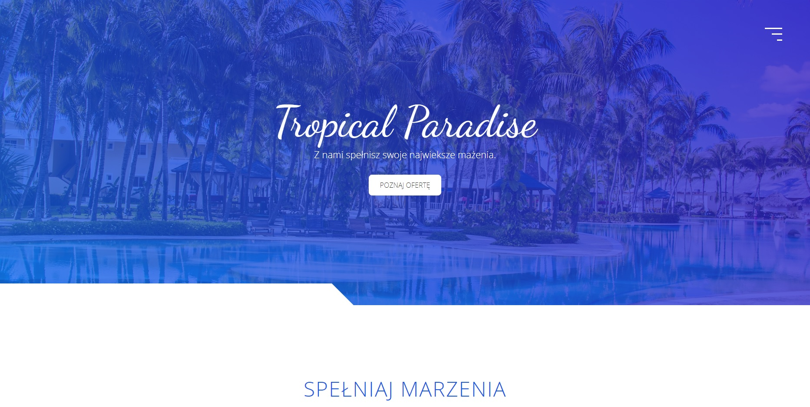

# Strona Tropical Paradise
[link do strony](https://rafalbalinski.github.io/TropicalParadiseWebsite/)

## O Projekcie
Serwis internetowy do wynajmu wysp. Struktura projektu została oparta o wzorzec BEM.

## Narzędzia
- HTML5
- CSS3
- JS ES6
- Sass
- BEM
  
